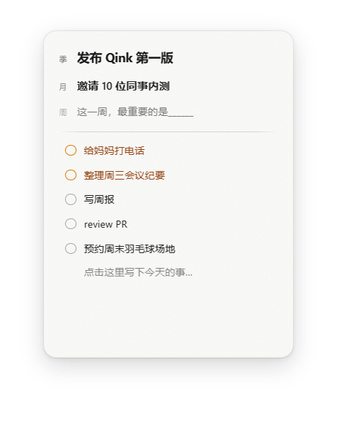

# Qink

一张常驻 Windows 桌面的毛玻璃便利贴——季 / 月 / 周核心目标立在最上面，今日任务排在下面。让最重要的事，天天被看见。



## 特性

- **常驻桌面**：无边框毛玻璃贴纸，可拖到桌面任何角落；不用时收成一颗悬浮球
- **季 / 月 / 周核心目标**：同一时刻各只有一条，周期更替自动清空——它的作用是被天天看见，而不是被分解执行
- **今日任务**：输入行回车添加、拖拽排序换位；昨天没做完的滚入今天，颜色区分
- **碎裂完成动画**：点完成圈，任务像玻璃一样碎裂消散（撞击点放射蛛网 + 发丝裂纹）
- **已完成清单**：完成的任务滚入琥珀橙清单永久存档，可按日期翻阅，双击即修复还原
- **截止时间**：右键设定；剩余不足 24 小时自动置顶标红，逾期时悬浮球出现常亮裂缝
- **空闲自动收起**：展开状态 10 分钟无交互，自动收成悬浮球，双击展开
- **数据本地存储**：明文 JSON 存在「文档\Qink\」，无云端、无账号、无遥测


## 安装

从源码打包（需先安装 Node.js，项目以 22 版本开发）：

```powershell
npm install
npm run package
```

产物在 `dist/`：NSIS 安装包与便携版。

> 国内网络打包需先设置 Electron 镜像（PowerShell）：
>
> ```powershell
> $env:ELECTRON_MIRROR = "https://npmmirror.com/mirrors/electron/"
> $env:ELECTRON_BUILDER_BINARIES_MIRROR = "https://npmmirror.com/mirrors/electron-builder-binaries/"
> ```

## 开发

```powershell
npm install
npm run dev        # 开发模式（改主进程/preload 需完全重启，渲染层热更新）
npm test           # vitest，52 个单测
npm run typecheck  # TypeScript 类型检查
```

技术栈：Electron 38 · electron-vite 5 · TypeScript · 原生 DOM（无前端框架）

```
src/main       窗口 / 托盘 / 数据存取
src/preload    IPC 桥
src/renderer   UI / 手势 / 动画
src/shared     纯逻辑（单测覆盖）
tests/         vitest
```

## 项目文档

本项目采用 AI 结对开发，开发过程文档完整保留：

- [CONTEXT.md](CONTEXT.md) — 领域术语表（便利贴 / 核心目标 / 翻篇 / 滚入任务……）
- [docs/adr/](docs/adr/) — 8 篇架构决策记录（玻璃合成、阴影体系、自适应高度……）
- [docs/review/](docs/review/) — 5 篇全面代码审查（UX / 性能 / 代码质量 / 数据安全 / 测试工程化）
- `.scratch/` — 各功能的 spec 与验收工件（截图、验证脚本、采样数据）
- `tasks/` — 开发规划与里程碑笔记

## License

[MIT](LICENSE)
